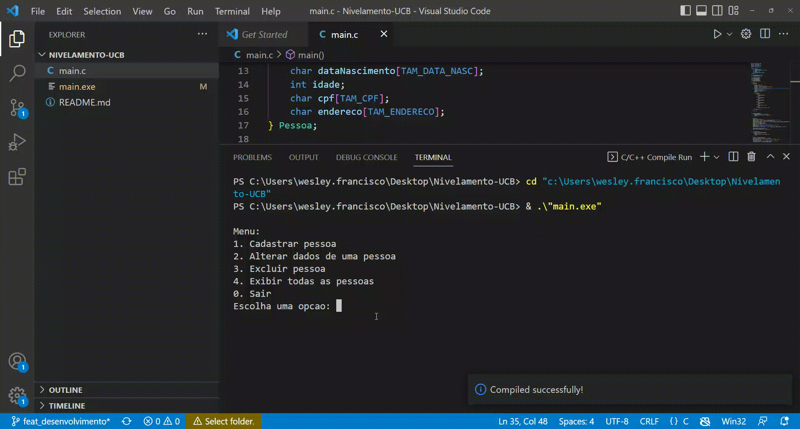
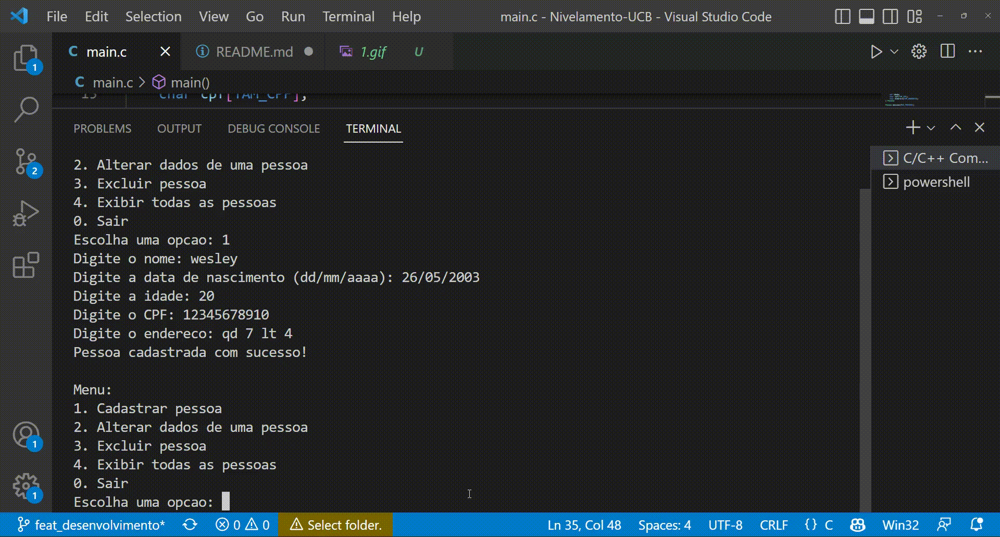
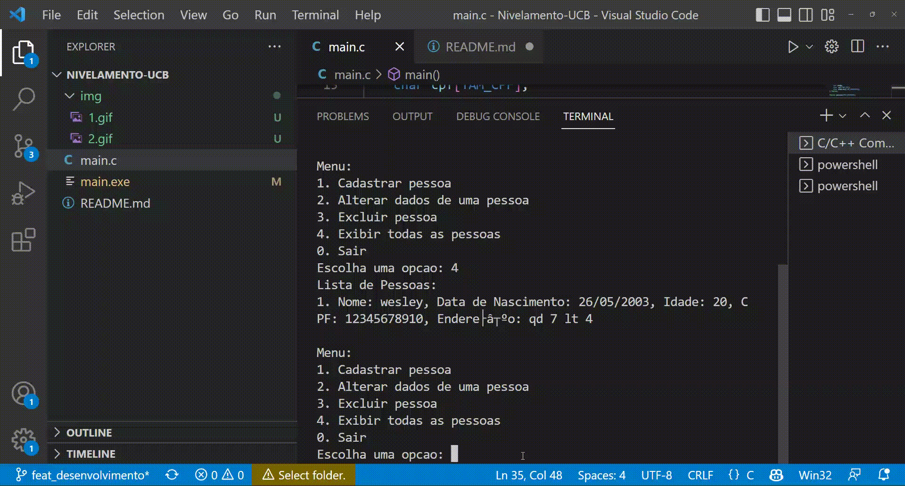
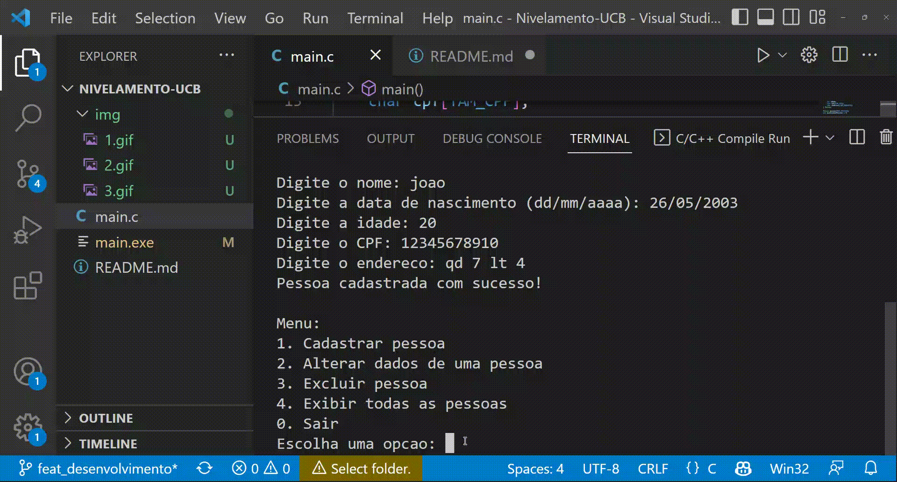

# PROJETO DE NÍVELAMENTO - Universidade Católica de Brasília:

**Criar um programa que permita ao usuário:**

1. Cadastrar número indeterminado de cadastro de pessoas;

2. Deve-se "armazenar": Nome, Data de Nascimento, Idade, CPF, Endereço;

3. Deve-se permitir alterar quaisquer um dos dados;

4. Deve-se permitir excluir quaisquer um dos registros.

# Contexto
O sistema atual é um programa que desenvolvemos utilizando a linguagem C para criar uma aplicação que gerencia um cadastro de pessoas. Ele permite ao usuário realizar operações como cadastrar novas pessoas, alterar dados existentes, excluir registros e exibir todos os registros armazenados. No entanto.

# Decisão
Decidimos implementar um sistema de cadastro de pessoas em C, fornecendo um conjunto básico de funcionalidades para gerenciar registros de pessoas. Para tornar o sistema mais amigável.

# Rationale
Funcionalidades Essenciais: O sistema fornece operações fundamentais para gerenciar um cadastro de pessoas, como adicionar, modificar, excluir e exibir registros.

**Simplicidade e Eficiência:** O código é estruturado de forma simples e eficiente, permitindo que os usuários interajam com o sistema de maneira direta e sem complicações excessivas.

# Consequências

**Manutenção Simplificada:** A estrutura clara do código facilita a manutenção futura, permitindo que novas funcionalidades sejam adicionadas ou ajustes sejam feitos de forma eficiente.

**Adaptabilidade Internacional:** Embora o sistema tenha sido adaptado para atender às necessidades locais brasileiras, ele pode ser facilmente estendido para oferecer suporte a outras localizações, conforme necessário.

# Status
Aceito. O sistema de cadastro de pessoas em C foi implementado com sucesso, proporcionando uma experiência de usuário localizada e eficaz para os usuários brasileiros.
